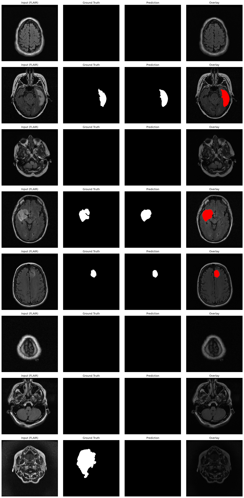

# 🔮 ORACLE — Oncology Reconstruction And Clinical Learning Engine

<div align="center">


**Predicting Tomorrow's Tumors from Today's MRI**

</div>

---

## 📋 Overview

ORACLE is an end-to-end deep learning framework for brain tumor analysis that combines **segmentation**, **3D reconstruction**, and **growth prediction**. Using multimodal MRI inputs, ORACLE can:

- ✅ Segment and localize tumors with pixel-level precision using 4 MRI modalities (`t1n`, `t1c`, `t2w`, `t2f`)
- 🔄 Reconstruct full 3D brain volumes from sparse slice observations via GAN-based generation
- 📈 *(Planned)* Predict tumor evolution using Physics-Informed Neural Networks (PINNs)

This project addresses the critical clinical need for **early intervention planning** by providing accurate 3D reconstructions and segmentation maps from sparse clinical MRI acquisitions.

---

## ✨ Features

### 🎯 1. Tumor Segmentation (`unet_plusplus_brain_tumor_segmentation.ipynb`)

- **UNet++** with **EfficientNet-B4** encoder and **SCSE** (Spatial & Channel Squeeze-Excitation) attention in the decoder (`segmentation_models_pytorch`)
- 4-channel multimodal MRI input (`t1n`, `t1c`, `t2w`, `t2f`) → binary tumor mask output
- Hybrid loss: **70% DiceCE** (λ_dice=0.6, λ_ce=0.4) + **30% Focal** (γ=2.0, α=0.75)
- Weighted stratified sampling to handle class imbalance (upweights small/medium tumors)
- Patient-level 70/15/15 train/val/test split (no patient leakage)
- Morphological post-processing (opening + closing with 5×5 elliptical kernel)
- Test-Time Augmentation (TTA): horizontal/vertical flips + 90°/180°/270° rotations
- Evaluation: Dice coefficient & IoU at threshold 0.5

<div align="center">

<br><em>Segmentation results: Input T1c · Ground Truth · Prediction · Overlay</em>
</div>

### 🧊 2. Sparse-to-Dense 3D Volume Reconstruction

Two-phase training pipeline: a generator-only pretraining stage followed by GAN-based adversarial fine-tuning.

#### Phase 1 — Generator Pretraining (`3d-recon-gen.ipynb`)

- **Fast2p5D** architecture: per-slice 2D CNN encoder (SliceCNN2D, 5→48→96 channels) with depth-wise attention fusion, feeding a 2-level UNet decoder (128→256→512→256→128→1)
- Input: 5-channel context window (`t1n`, `t1c`, `t2w`, `t2f`, `mask_density`) over 5 consecutive slices `[z..z+4]`
- Target: next non-overlapping T1n slice `[z+5]`
- Loss: **2×MSE + 0.5×(1−SSIM) + 0.1×smoothness** (adjacent-slice consistency)
- AdamW (lr=1e-4), CosineAnnealingLR (200 epochs), gradient accumulation (8 steps), EMA (decay=0.999)
- Early stopping on validation PSNR (patience=20)

#### Phase 2 — GAN Adversarial Fine-Tuning (`3d-recon-disc.ipynb`)

- **VolumeDiscriminator**: 3D convolutional classifier operating on 5-slice stacks `[B,5,H,W]` — three Conv3d layers (1→32→64→128, LeakyReLU 0.2, BatchNorm3d) with AdaptiveAvgPool3d → linear head. Enforces z-axis (depth) volumetric consistency.
- Adversarial loss: LSGAN-style MSE (λ_adv=0.01) added to reconstruction loss
- Reconstruction loss: **MSE + (1−SSIM) + FFT-L1** on 5-slice stacks
- Two-phase training: **3-epoch D-warmup** (G frozen) → **8-epoch joint** (D updates every 10 batches to prevent collapse)
- Optimizers: Adam (G: lr=1e-5, D: lr=1e-4, betas=(0.5, 0.999))

#### Inference Pipeline

- **Bidirectional autoregressive** full-volume reconstruction (forward + backward passes with distance-weighted fusion)
- **Multi-scale** inference (1.0 + 0.85 scales, weighted 0.65/0.35)
- **TTA**: 4 modes (none, hflip, vflip, hvflip)
- **Post-processing**: per-slice median filter (k=3), Gaussian blur (σ=0.7), unsharp masking (α=0.10)
- Evaluation: PSNR / SSIM on held-out volumes

<div align="center">

<br><em>GAN reconstruction from 50% sparse input (half-alternating, all 5 channels)</em>
</div>

#### 3D Visualization

- **Marching cubes** isosurface extraction from the predicted volume
- Interactive **Plotly** 3D mesh with vertex intensity coloring (grayscale), adjustable ISO level, X-sectioning, rotation/scale/translate controls
- Exportable mesh data (`assets/recon_media_disc/meshes/`)

> **[Explore the 3D brain mesh interactively](https://enricotazzer.github.io/ORACLE/brain_mesh_viewer.html)** — rotate, zoom, toggle cross-sections and volume fill directly in your browser.

### ⏱️ 3. Physics-Informed Tumor Growth Prediction *(Planned)*

> **Status: not yet implemented** — this module is planned for a future iteration.

- PINN implementation of Fisher-Kolmogorov reaction-diffusion equation
- Patient-specific parameter estimation (diffusion D, proliferation ρ)
- Forward prediction with uncertainty quantification

---

## 🏗️ Architecture

### Pipeline Overview

```
┌─────────────────────────────────────────────────────────────┐
│                    ORACLE Pipeline                          │
└─────────────────────────────────────────────────────────────┘
                            │
                     Multimodal MRI Input
                  (t1n, t1c, t2w, t2f volumes)
                            │
                            ▼
                  ┌─────────────────────┐
                  │ Segmentation Module │ → Binary Tumor Mask
                  │  UNet++ (EffNet-B4) │
                  │  + SCSE Attention   │
                  └─────────────────────┘
                            │
                            ▼
                  ┌────────────────────────┐
                  │ Reconstruction Module  │ → Full 3D Volume
                  │  Fast2p5D Generator   │
                  │  + VolumeDiscriminator │
                  │  (bidirectional fuse)  │
                  └────────────────────────┘
                            │
                            ▼
                  ┌───────────────────┐
                  │   PINN Module     │ → Growth Prediction
                  │  (planned)        │    (t + 3–6 months)
                  └───────────────────┘
                            │
                            ▼
                 3D Visualization
                 (Marching cubes + Plotly)
```

### Module Details

| Module | Input | Output | Technology |
|--------|-------|--------|------------|
| **Segmentation** | 4-ch MRI slice (`t1n`,`t1c`,`t2w`,`t2f`) | Binary tumor mask | UNet++ (EfficientNet-B4 + SCSE) |
| **Reconstruction** | 5-ch, 5-slice context window | 3D volume (autoregressive) | Fast2p5D + VolumeDiscriminator (GAN) |
| **PINN** *(planned)* | u₀(x), time t | Predicted u(t,x) | Physics-informed neural network |

---
