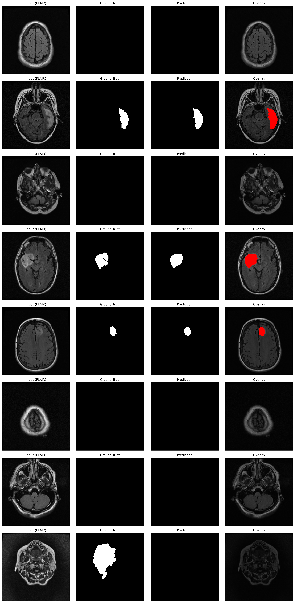
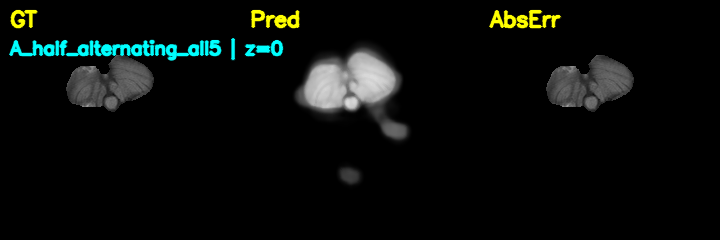
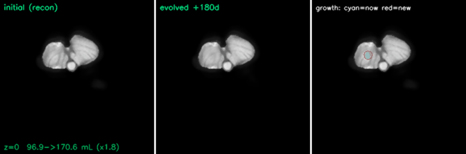

# 🔮 ORACLE — Oncology Reconstruction And Clinical Learning Engine

<div align="center">


**Predicting Tomorrow's Tumors from Today's MRI**

</div>

---

## 📋 Overview

ORACLE is an end-to-end deep learning framework for brain tumor analysis that combines **segmentation**, **3D reconstruction**, and **growth prediction**. Using multimodal MRI inputs, ORACLE can:

- ✅ Segment and localize tumors with pixel-level precision using 4 MRI modalities (`t1n`, `t1c`, `t2w`, `t2f`)
- 🔄 Reconstruct full 3D brain volumes from sparse slice observations via GAN-based generation
- 📈 Predict tumor evolution and recover patient-specific growth parameters using Physics-Informed Neural Networks (PINNs)

This project addresses the critical clinical need for **early intervention planning** by providing accurate 3D reconstructions and segmentation maps from sparse clinical MRI acquisitions.

---

## ✨ Features

### 🎯 1. Tumor Segmentation (`unet_plusplus_brain_tumor_segmentation.ipynb`)

- **Custom nnU-Net 2D** — compact encoder–decoder (~0.7M params, ~30× lighter than the previous UNet++ EfficientNet-B4) following nnU-Net design principles:
  - **GroupNorm + LeakyReLU** (numerically stable on small batches and near-empty MRI slices)
  - Strided convolutions for learned downsampling, transposed convolutions for upsampling
  - **Deep supervision** from decoder stages (loss weights 1.0 / 0.5 / 0.25)
  - **Full-path Dropout2d** (encoder + bottleneck + decoder) for regularization
- 4-channel multimodal MRI input (`t1n`, `t1c`, `t2w`, `t2f`) → binary tumor mask output
- Hybrid loss: **70% DiceCE** (λ_dice=0.6, λ_ce=0.4) + **30% Focal** (γ=2.0, α=0.75) + **empty-slice false-positive penalty** (applied to the full-resolution head only)
- **EMA** of weights (decay=0.999) — the deployed model is the weight moving average, not the final SGD step
- Optimizer: **AdamW** (lr=1e-4, weight_decay=1e-3) with **CosineAnnealingWarmRestarts** (T₀=20, T_mult=2)
- Empty-mask slice subsampling (all tumor slices + 40% of empty slices) to counter the blank-mask majority
- Heavy augmentation: flips, rotation, shift-scale-rotate, elastic + grid distortion, brightness/contrast, gamma, Gaussian noise/blur, coarse dropout
- Patient-level train/val/test split using **all timepoints per patient** (no patient leakage)
- **Deployment-matched validation**: model selection uses EMA + TTA + post-processing, not raw single-pass Dice
- **Snapshot ensembling**: EMA weights saved at each cosine restart, predictions averaged at inference
- Post-processing: morphological opening + closing (5×5 elliptical), hole fill, largest-connected-component selection
- Test-Time Augmentation (TTA): horizontal/vertical flips + 90°/180°/270° rotations
- Evaluation: Dice coefficient & IoU at threshold 0.5 — **test ≈ 0.84 Dice / 0.80 IoU** (single-fold, EMA + TTA + post-processing)

<div align="center">

<br><em>Segmentation results: Input T1c · Ground Truth · Prediction · Overlay</em>
</div>

### 🧊 2. Sparse-to-Dense 3D Volume Reconstruction

Two-phase training pipeline: a generator-only pretraining stage followed by GAN-based adversarial fine-tuning.

#### Phase 1 — Generator Pretraining (`3d-recon-gen.ipynb`)

- **Fast2p5D** architecture: per-slice 2D CNN encoder (SliceCNN2D, 5→48→96 channels) with depth-wise attention fusion, feeding a 2-level UNet decoder (128→256→512→256→128→1)
- Input: 5-channel context window (`t1n`, `t1c`, `t2w`, `t2f`, `mask_density`) over 5 consecutive slices `[z..z+4]`
- Target: next non-overlapping T1n slice `[z+5]`
- Loss: **2×MSE + 0.5×(1−SSIM) + 0.1×smoothness** (adjacent-slice consistency)
- AdamW (lr=1e-4), CosineAnnealingLR (200 epochs), gradient accumulation (8 steps), EMA (decay=0.999)
- Early stopping on validation PSNR (patience=20)

#### Phase 2 — GAN Adversarial Fine-Tuning (`3d-recon-disc.ipynb`)

- **VolumeDiscriminator**: 3D convolutional classifier operating on 5-slice stacks `[B,5,H,W]` — three Conv3d layers (1→32→64→128, LeakyReLU 0.2, BatchNorm3d) with AdaptiveAvgPool3d → linear head. Enforces z-axis (depth) volumetric consistency.
- Adversarial loss: LSGAN-style MSE (λ_adv=0.01) added to reconstruction loss
- Reconstruction loss: **MSE + (1−SSIM) + FFT-L1** on 5-slice stacks
- Two-phase training: **3-epoch D-warmup** (G frozen) → **8-epoch joint** (D updates every 10 batches to prevent collapse)
- Optimizers: Adam (G: lr=1e-5, D: lr=1e-4, betas=(0.5, 0.999))

#### Inference Pipeline

- **Bidirectional autoregressive** full-volume reconstruction (forward + backward passes with distance-weighted fusion)
- **Multi-scale** inference (1.0 + 0.85 scales, weighted 0.65/0.35)
- **TTA**: 4 modes (none, hflip, vflip, hvflip)
- **Post-processing**: per-slice median filter (k=3), Gaussian blur (σ=0.7), unsharp masking (α=0.10)
- Evaluation: PSNR / SSIM on held-out volumes

<div align="center">

<br><em>GAN reconstruction from 50% sparse input (half-alternating, all 5 channels)</em>
</div>

#### 3D Visualization

> **[Explore the interactive 3D brain viewer](https://enricotazzer.github.io/ORACLE/brain-viewer/)** — orbit, zoom, pan, clip through the volume along any anatomical axis, and take screenshots directly in your browser.

The GAN-predicted volume is rendered through a full production pipeline (`brain-gan-viewer/`) that converts raw MRI slices into a deployable Three.js web viewer hosted on GitHub Pages.

The viewer also supports a **`Volume` toggle** — switch between the patient's **current** reconstruction and its **PINN-predicted future** (the Stage-4 evolved volume) from the *same* camera and clip position, for a direct 3D before/after comparison. `full_pipeline_testing.ipynb` exports both slice stacks; `generate_brain.py --variant initial|evolved` builds them (see [`brain-gan-viewer/README.md`](brain-gan-viewer/README.md#multiple-volumes--initial-vs-evolved-pinn-toggle)).

##### Pipeline overview

```
GAN MRI slices (PNG)
        │
        ▼
  generate_brain.py
  ├── Percentile normalisation + Gaussian denoise (σ=0.8)
  ├── Otsu threshold + morphological closing + hole fill
  ├── Largest-connected-component brain mask
  ├── Taubin-smoothed marching cubes → brain_surface.glb
  │     (vertex colours sampled from MRI intensity, γ=0.75)
  └── RGBA PNG slice exports (axial / coronal / sagittal)
        │
        ▼
  viewer/  (Three.js static site, no build step)
  ├── Realistic cortex shell with MRI-intensity vertex colours
  ├── Clipping plane synchronised to MRI slice texture
  └── Orbit / zoom / pan / screenshot controls
        │
        ▼
  docs/brain-viewer/  (GitHub Pages)
```

##### Files

| File | Purpose |
| ---- | ------- |
| `brain-gan-viewer/generate_brain.py` | Core preprocessing: normalisation → mask → marching cubes → Taubin smoothing → GLB export → RGBA PNG slices |
| `brain-gan-viewer/run_pipeline.py` | End-to-end orchestrator: validates inputs, runs `generate_brain.py`, runs `prepare_github_pages.py` |
| `brain-gan-viewer/prepare_github_pages.py` | Copies `viewer/` to `docs/brain-viewer/`, injects `<base href>` for sub-path routing, verifies all assets |
| `brain-gan-viewer/viewer/app.js` | Three.js application: GLB loader, clipping plane logic, slice quad texture, orbit controls, screenshot |
| `brain-gan-viewer/viewer/index.html` | Static HTML shell with Three.js importmap (CDN, no build step) and control panel UI |
| `brain-gan-viewer/viewer/style.css` | Dark-mode UI styles |

##### How to run it yourself

```bash
# 1 — install dependencies
cd brain-gan-viewer
pip install -r requirements.txt

# 2 — place GAN slices in data/gan_slices/slice_000.png … slice_NNN.png

# 3 — run the full pipeline
python run_pipeline.py \
  --input_dir  ./data/gan_slices \
  --axis       axial \
  --pixel_spacing   1.0 \
  --slice_thickness 1.0 \
  --github_pages_subpath /ORACLE/brain-viewer/

# 4 — preview locally
cd docs/brain-viewer
python -m http.server 8080
# open http://localhost:8080

# 5 — commit docs/brain-viewer/ and push to enable GitHub Pages
```

Key preprocessing parameters:

| Flag | Default | Effect |
| ---- | ------- | ------ |
| `--smooth_sigma` | 0.8 | Gaussian σ on volume (suppresses GAN checkerboard artefacts) |
| `--field_sigma` | 1.5 | Gaussian σ on mask field before marching cubes (smooth iso-surface) |
| `--taubin_iter` | 25 | Taubin smoothing iterations (volume-preserving cortex smoothing) |
| `--decimate_fraction` | 0.85 | Face reduction after marching cubes (smaller GLB) |
| `--max_slices` | 128 | Slice PNGs exported per axis (reduce to lower repo size) |

### ⏱️ 3. Physics-Informed Tumor Growth Prediction (`pinn_tumor_growth.ipynb`)

Inverse-problem PINN that recovers patient-specific growth parameters from sparse tumor-density observations and forward-predicts tumor evolution, on the **BraTS 2024** dataset (with a finite-difference synthetic fallback when the dataset is unavailable).

- **Governing PDE**: heterogeneous Fisher–Kolmogorov reaction–diffusion `uₜ = ∇·(D(x)∇u) + ρ·u(1−u)`, with **tissue-dependent diffusion** — separate `D_wm` (white matter) / `D_gm` (gray matter) selected by a segmentation-derived, double-backward-safe bilinearly-sampled mask
- **Network**: Fourier-feature embedding of `(x, y, t)` → 6 × `TanhSlopeLinear` (learnable per-layer activation slope α, width 128) → sigmoid head (output bounded to `u ∈ [0,1]` by construction)
- **Inverse parameters** estimated in log-space: `D_wm`, `D_gm`, `ρ`, with log-Gaussian priors
- **Composite loss**: PDE residual + initial condition (Gaussian seed) + zero-flux Neumann BC + data + log-prior, with **gradient-norm adaptive weighting** clamped to `[init/4, init×4]` so no term collapses or dominates
- **Collocation**: Latin-Hypercube sampling + **Residual-based Adaptive Refinement (RAR)** + a **time-horizon curriculum** (short horizons first, grown geometrically)
- **Three-phase training**: (1) network-only warm-up with physics frozen → (2) joint Adam with cosine warm restarts (physics LR 50× the network LR, network-only gradient clipping so the 3 physics scalars keep full signal) → (3) L-BFGS strong-Wolfe fine-tune
- **Uncertainty quantification** — three independent estimators:
  - **MC-Dropout** (stochastic forward passes at inference)
  - **Deep Ensemble** (K independently-seeded PINNs)
  - **Laplace posterior** on `(D_wm, D_gm, ρ)` — Hessian of the data + log-prior likelihood, regularized with the **prior precision** so credible intervals stay principled and bounded by the prior
- **Evaluation**: parameter recovery vs. synthetic ground truth, held-out observation R²/MSE, field metrics at the prediction horizon (L2 relative error, DICE, Hausdorff, mean PDE residual), and UQ calibration (95% coverage, CI width)
- **Checkpointing**: trained primary PINN + full deep ensemble + config + recovered parameters saved to a single `.pt`, with a self-contained `load_pinn()` reload helper

> **Status: complete** — the pipeline runs end-to-end and its outputs feed Stage 3/4 of the full pipeline. Parameter-recovery accuracy and UQ calibration are usable but not exhaustively tuned; see [Future Work](#-future-work).

---

## 🏗️ Architecture

### Pipeline Overview

```
┌─────────────────────────────────────────────────────────────┐
│                    ORACLE Pipeline                          │
└─────────────────────────────────────────────────────────────┘
                            │
                     Multimodal MRI Input
                  (t1n, t1c, t2w, t2f volumes)
                            │
                            ▼
                  ┌─────────────────────┐
                  │ Segmentation Module │ → Binary Tumor Mask
                  │  nnU-Net 2D (0.7M)  │
                  │  + Deep Supervision │
                  └─────────────────────┘
                            │
                            ▼
                  ┌────────────────────────┐
                  │ Reconstruction Module  │ → Full 3D Volume
                  │  Fast2p5D Generator   │
                  │  + VolumeDiscriminator │
                  │  (bidirectional fuse)  │
                  └────────────────────────┘
                            │
                            ▼
                  ┌───────────────────┐
                  │   PINN Module     │ → Growth Prediction
                  │ Fisher–KPP + UQ   │    (forward in time)
                  └───────────────────┘
                            │
                            ▼
                 3D Visualization
                 (Marching cubes + Plotly)
```

### Module Details

| Module | Input | Output | Technology |
|--------|-------|--------|------------|
| **Segmentation** | 4-ch MRI slice (`t1n`,`t1c`,`t2w`,`t2f`) | Binary tumor mask | nnU-Net 2D (GroupNorm, deep supervision) + EMA + TTA + snapshot ensemble |
| **Reconstruction** | 5-ch, 5-slice context window | 3D volume (autoregressive) | Fast2p5D + VolumeDiscriminator (GAN) |
| **PINN** | Sparse tumor-density obs `u(x,y,t)` | Recovered `D_wm/D_gm/ρ` + predicted `u(x,y,t)` + UQ | Inverse Fisher–KPP PINN (Fourier features, RAR, MC-Dropout / Ensemble / Laplace) |

---

## 🔄 End-to-End Pipeline — Predictive Tumor Evolution (`full_pipeline_testing.ipynb`)

A single notebook chains **all three trained models into a closed predictive loop** on one
patient timepoint (`PatientID_0003/Timepoint_1`, the first folder of the nnU-Net MU-Glioma
dataset). It loads the checkpoints (`best_nnunet2d.pth`, `G_joint_epoch_022.pth`,
`pinn_tumor_growth.pt`) and runs **detect → reconstruct → recover-dynamics → evolve →
re-detect → re-reconstruct**:

```
        4-modality MRI (t1n, t1c, t2w, t2f)
                        │
   ┌────────────────────▼─────────────────────┐
   │ 1 · Segmentation — nnU-Net 2D             │  EMA weights + 16-aug TTA
   │     (deep supervision)                    │  + morphological post-processing
   └────────────────────┬─────────────────────┘  → tumor mask
                        │ (mask conditions the GAN)
   ┌────────────────────▼─────────────────────┐
   │ 2 · Reconstruction — Fast2p5D GAN         │  sparse anchors → dense volume
   │     bidirectional · multi-scale · TTA     │  (median + Gaussian + unsharp)
   └────────────────────┬─────────────────────┘  → initial volume
                        │
   ┌────────────────────▼─────────────────────┐
   │ 3 · Growth — Inverse Fisher–KPP PINN      │  recover patient-specific
   │                                           │  D_wm / D_gm / ρ
   └────────────────────┬─────────────────────┘
                        │ (recovered dynamics)
   ┌────────────────────▼─────────────────────┐
   │ 4 · Evolution (closed loop)               │  anatomy-aware Fisher–KPP PDE
   │   • forward-evolve the DETECTED tumor     │  ∇·(D(x)∇u)+ρ·u(1−u), slice-by-slice
   │   • composite back into all 4 modalities  │  necrotic core / enhancing rim / edema
   │   • nnU-Net re-segments the evolved slices │
   │   • GAN re-reconstructs the evolved volume │
   └────────────────────┬─────────────────────┘
                        ▼
        initial volume   vs   predicted future volume
```

**Stage 4 closes the loop**: the PINN-recovered dynamics drive a forward, anatomy-aware
reaction–diffusion PDE (high diffusion in white matter, ~0 in CSF/ventricles, no-flux brain
boundary, optional contralateral barrier) that grows the *detected* tumor over a chosen
horizon. The evolved tumor is composited back into the MRI with a heterogeneous appearance
(necrotic core, enhancing rim, edema halo), **re-segmented** by nnU-Net, and
**re-reconstructed** by the GAN — yielding a side-by-side comparison of the patient's current
brain vs its predicted future, plus tumor-volume (mL), equivalent-diameter, and growth-ratio
readouts. All growth knobs live in a single `GROWTH_CFG` (`rho_scale`, `D_scale`,
`horizon_days`, …); set the scales to `1.0` for the physically faithful (subtle) regime.

### Qualitative Result

<div align="center">

<br><em><b>Left:</b> initial GAN reconstruction · <b>Middle:</b> predicted evolution (+180 d) ·
<b>Right:</b> growth overlay — cyan = current tumor, red = predicted new growth.
Generated end-to-end by <code>full_pipeline_testing.ipynb</code>.</em>
</div>

---

## ✅ Project Status

**ORACLE is complete.** All three modules are trained, evaluated, and chained into a working
end-to-end pipeline, and the 3D viewer is deployed. The repository is considered finished as a
research prototype — no further development is planned beyond the items in
[Future Work](#-future-work) below, which are open directions rather than pending tasks.

What is done and reproducible today:

| Component | State | Artifact |
| --------- | ----- | -------- |
| Tumor segmentation (nnU-Net 2D) | ✅ Trained & evaluated — test ≈ 0.84 Dice / 0.80 IoU | `models/best_nnunet2d.pth` |
| Sparse-to-dense reconstruction (Fast2p5D + GAN) | ✅ Trained through adversarial fine-tuning, evaluated on held-out volumes (PSNR/SSIM) | `models/G_joint_epoch_022.pth`, `models/D_joint_epoch_022.pth` |
| Tumor growth PINN (inverse Fisher–KPP + UQ) | ✅ Trained, parameters recovered, UQ computed | `models/pinn_tumor_growth.pt` |
| Closed-loop pipeline (detect → reconstruct → evolve → re-detect → re-reconstruct) | ✅ Runs end-to-end on a patient timepoint | `full_pipeline_testing.ipynb` |
| Interactive 3D viewer (initial vs. PINN-evolved) | ✅ Built and deployed to GitHub Pages | [`docs/brain-viewer/`](https://enricotazzer.github.io/ORACLE/brain-viewer/) |

### Known limitations

These are intentional scope boundaries of the prototype, not defects to be fixed here:

- **Single-fold, single-institution evaluation.** Segmentation and reconstruction were validated
  on one patient-level split of the MU-Glioma-Post cohort — no cross-validation, no external
  test set, no multi-centre generalisation study.
- **PINN growth is 2D and slice-wise.** The reaction–diffusion evolution is solved per slice on a
  2D grid rather than as a true 3D volumetric PDE, and the recovered `D_wm / D_gm / ρ` are fit to
  sparse observations without longitudinal ground truth for the prediction horizon.
- **Evolution is qualitative.** The Stage-4 growth knobs (`GROWTH_CFG`) are tuned for visible,
  illustrative change; the physically faithful regime (`rho_scale = D_scale = 1.0`) produces much
  subtler evolution. Predicted volumes have **not** been clinically validated against follow-up
  imaging.
- **UQ is uncalibrated.** MC-Dropout, deep-ensemble, and Laplace intervals are computed and
  reported, but their 95% coverage has not been rigorously calibrated.
- **Not a medical device.** Research and educational use only — not for diagnosis, treatment
  planning, or any clinical decision-making.

---

## 🔭 Future Work

Open directions for anyone extending ORACLE. None of these are in progress.

- **Full 3D PINN** — replace the slice-wise 2D Fisher–KPP solve with a volumetric
  `uₜ = ∇·(D(x)∇u) + ρ·u(1−u)` over the whole brain, with a DTI-derived anisotropic diffusion
  tensor instead of a scalar white/gray-matter split.
- **Longitudinal validation** — MU-Glioma-Post is multi-timepoint; train and validate growth
  prediction against *actual* follow-up scans rather than synthetic horizons, and report
  Dice/Hausdorff of predicted vs. observed tumor at the follow-up date.
- **Cross-validation & external cohorts** — k-fold patient-level CV for segmentation and
  reconstruction, plus an external test set (BraTS, UPENN-GBM) to measure domain shift.
- **Multi-class segmentation** — extend the binary mask to the BraTS sub-regions (enhancing
  tumor / necrotic core / peritumoral edema) so Stage 4 no longer needs its synthetic
  `APPEAR` compositing heuristic.
- **True 3D reconstruction backbone** — the 2.5D generator with autoregressive fusion could be
  replaced by a 3D or diffusion-based model that generates the volume directly, removing
  bidirectional-fusion seams.
- **UQ calibration** — calibrate the three uncertainty estimators (temperature scaling,
  conformal prediction) and propagate segmentation and reconstruction uncertainty forward into
  the growth prediction instead of treating each stage as deterministic.
- **Packaging** — extract the notebook code into an installable `oracle/` package with a CLI,
  pinned dependencies, and regression tests, so the pipeline runs without Jupyter.
- **Viewer** — tumor-surface overlay as a separate mesh, a time slider across multiple PINN
  horizons rather than a two-state toggle, and measurement tools.
